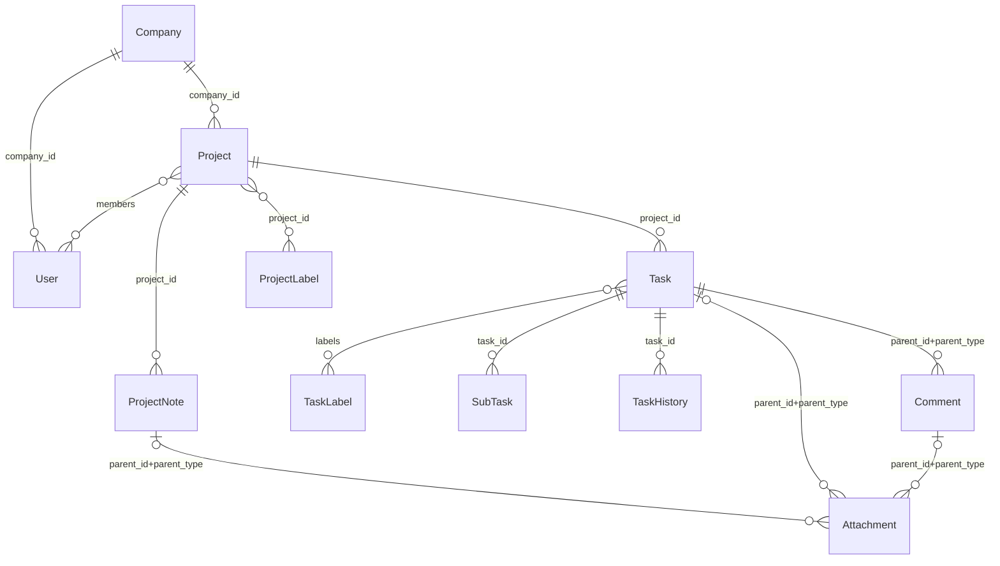

# ActiveCollab Objects

All objects are stored under `Account`.

Many objects have a reference to related project_id.

You need a Markdown Viewer with "[Mermaid](https://mermaid.js.org/)" Plugin to see the diagram.
