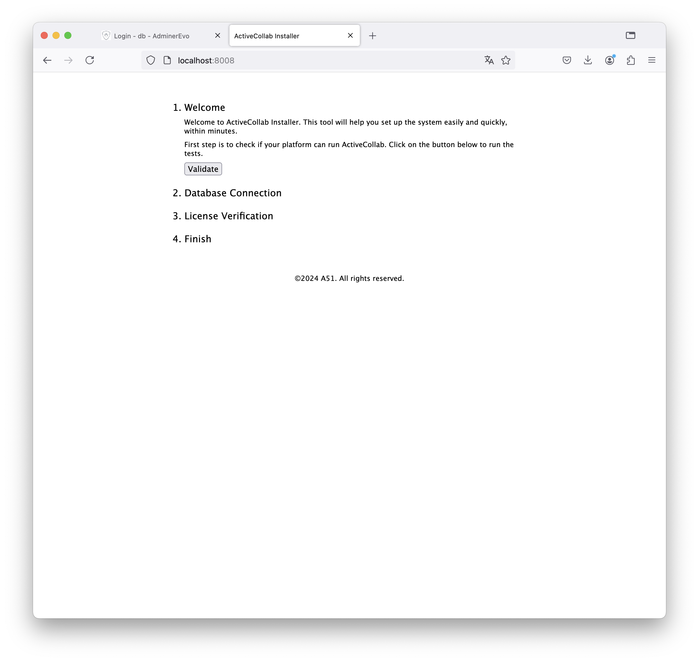
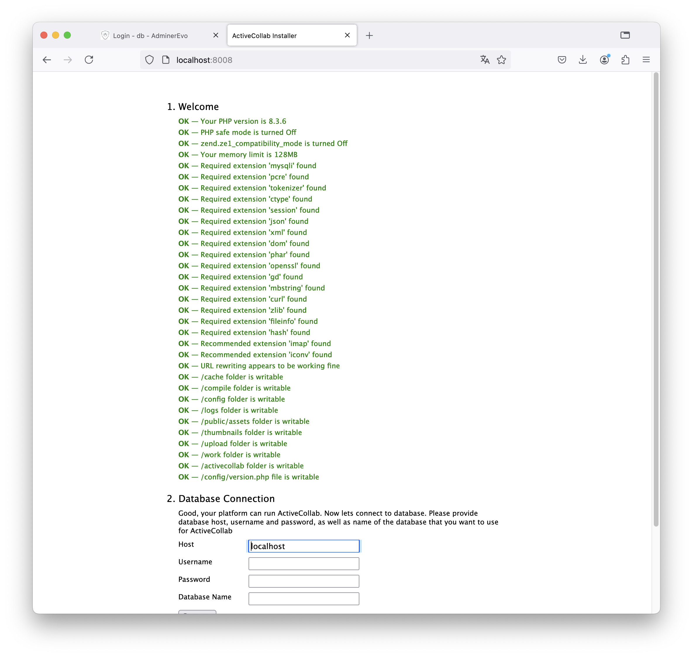
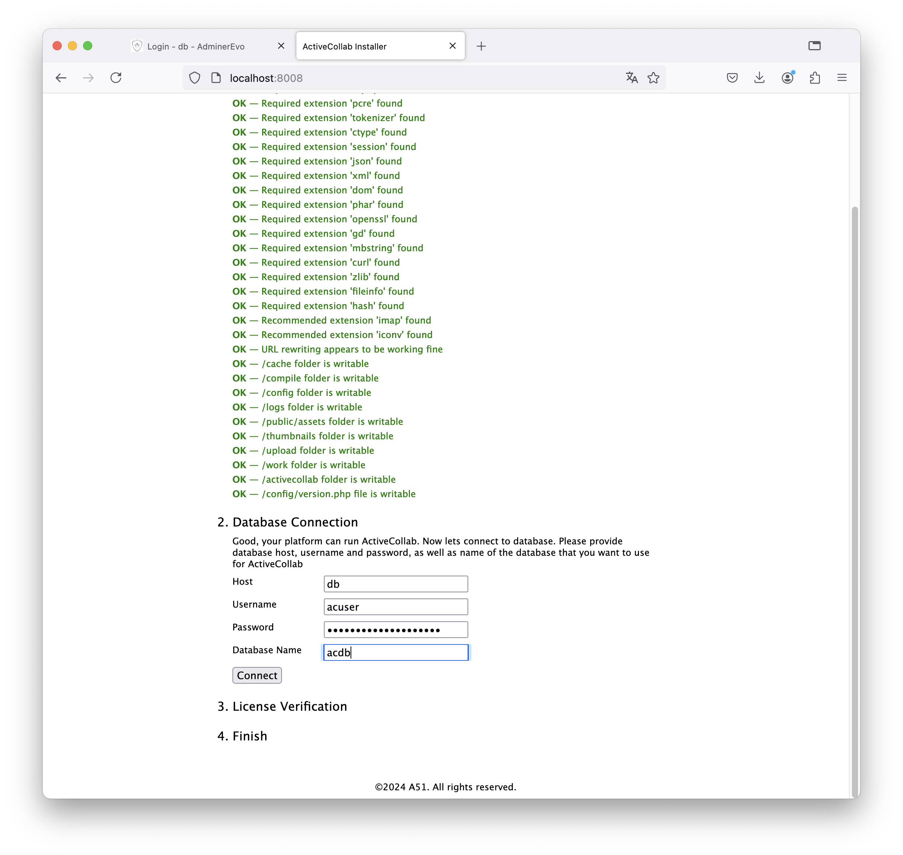
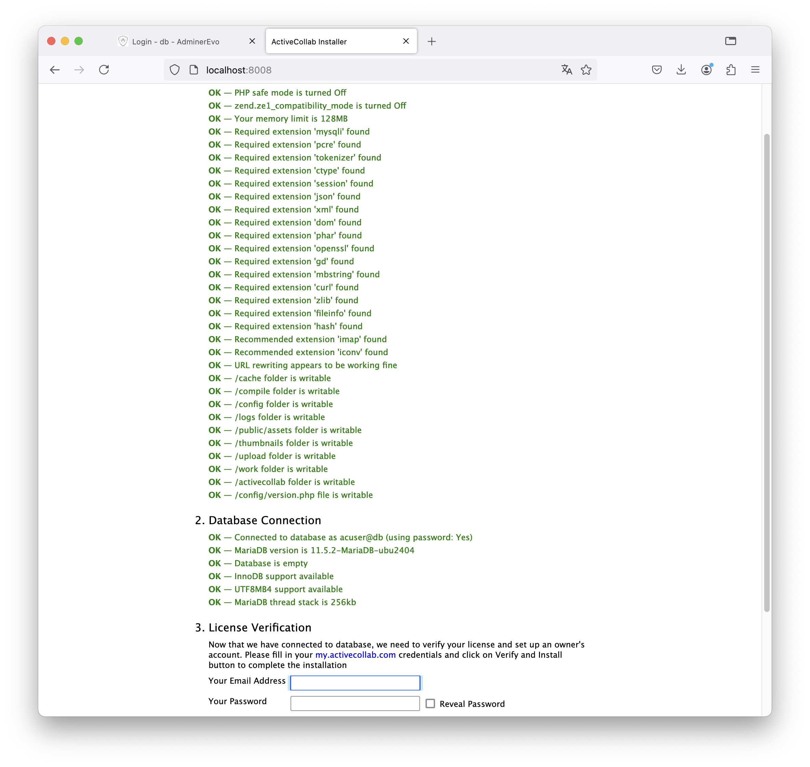
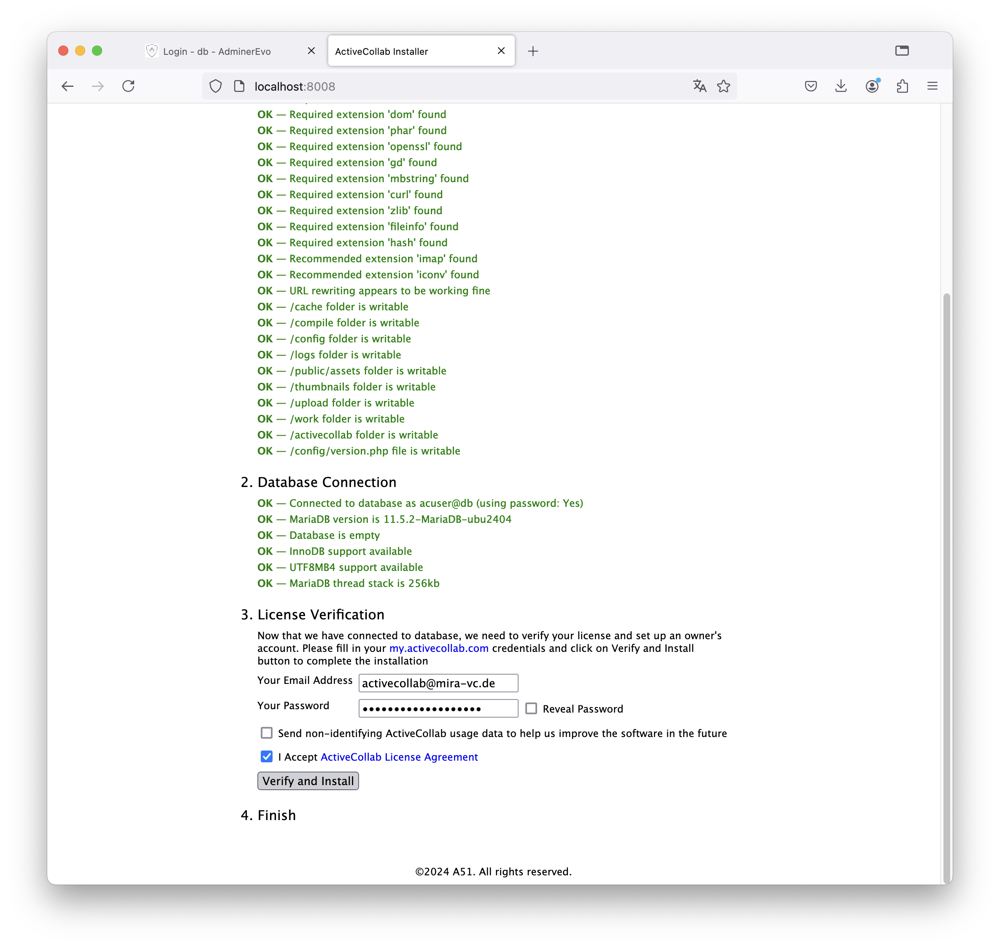
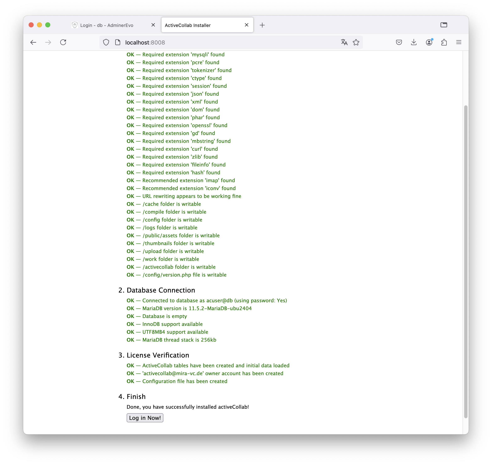
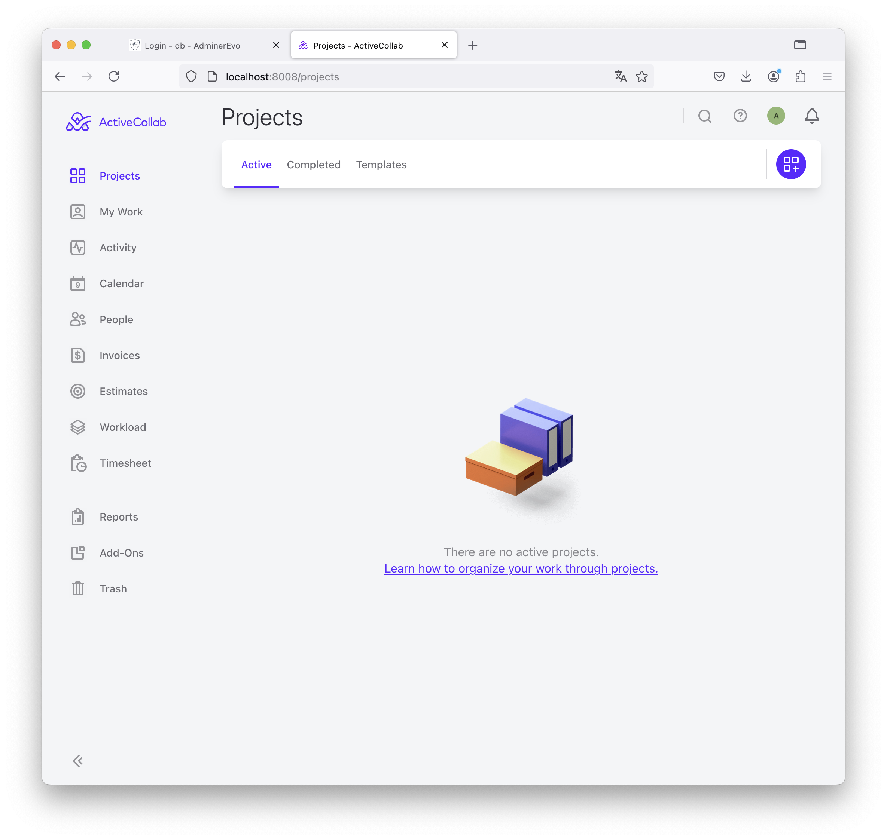

# Self-hosted Active Collab

This is a non-offical setup for Active-Collab running with Docker.

> You can find the official documentation for manual setup
> here: https://activecollab.com/help/books/self-hosted

## Local Active-Collab Server

Requirements: [Docker](https://www.docker.com/)

Download the Active Collab Server Software and put the ZIP file to
`ActiveCollabServer`. While writing this tool and documentation the
current version is `activecollab-7.4.375.zip`. If you need to change the
version please update the `Dockerfile`.

Create a `env` file to set the passwords

```bash
cd ActiveCollabServer
cp env-example env
vi env
```

Build the docker image and startup

```bash
cd ActiveCollabServer
docker compose build
docker compose up -d
```

Stop the service

```bash
docker compose down
# stop remove all data !!!!
docker compose down -v
```

### Database

Adminer for Database Access

http://localhost:8080/?server=db&username=root&db=mysql&select=user

### Setup ActiveCollab

> Find the original documentations
> at https://activecollab.com/help/books/self-hosted/requirements


Login http://localhost:8008/projects and run the setup wizard.



All checks should pass



Configure the database connection, use credentials from the `env` File



Then connection should work



Setup the first user-account, which is also the owner account:



Then finish the installation



Skip the creation of sample projects


The Server is ready now




